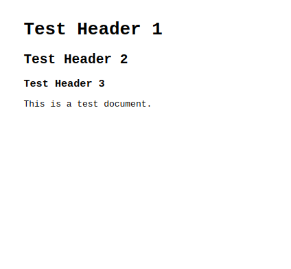
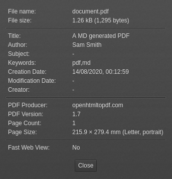

# clj-md2pdf

[](https://clojars.org/org.clojars.michael-valdron/clj-md2pdf)

A Clojure powered CLI tool and library for performing moderately complex 
Markdown to PDF document generation. A great 
tool for those who desire simple semi-programmatic document creation. 
Store your content in Markdown, style your 
document with CSS / fonts, set your document properties with readable EDN 
files.

# Contributors

- Author: Michael Valdron
- Maintainer: Michael Valdron

## Dependency Contribution

- [Open HTML To PDF](https://github.com/danfickle/openhtmltopdf): HTML to 
PDF Renderer / Core PDF Renderer
- [clj-htmltopdf](https://github.com/gered/clj-htmltopdf): Options data 
structure concept & CSS helper functions
- [hiccup](https://github.com/weavejester/hiccup): Provided the Hiccup 
data structure / Provided Hiccup to HTML5 API 
- [markdown-to-hiccup](https://github.com/mpcarolin/markdown-to-hiccup): 
Markdown to Hiccup data structure APIs
- [Jsoup](https://github.com/jhy/jsoup/): Later injection of styles and 
fonts / Provides compatibility for HTML5 with *Open HTML to PDF*
- [tools.cli](https://github.com/clojure/tools.cli): CLI argument parsing 
in Clojure

# Requirements

You need to install the **JRE 1.8+** in order to run this tool. For 
development it is expected you have **JDK 1.8+** and a **build tool** 
*(i.e. Leiningen or Clojure 1.9+)*. You will need **Leiningen** to 
directly work and/or contribute to this project.

# Installation
## CLI Tool
1. Download the latest release from [releases](https://github.com/michael-valdron/clj-md2pdf/releases).
2. Unzip the JAR file to a location to store the binary.

You can now try a run by doing:
```
java -jar /path/to/clj-md2pdf-<version>.jar /path/to/output/pdf /path/to/markdown/file(s)
```
You can also create an alias for `java -jar /path/to/clj-md2pdf-<version>.jar` so this can be used more conveniently with the CLI. The way to
achieve depends on the OS you are using.

**Linux**
```sh
# Add to your .<shell>rc, e.g. .bashrc if you are using bash
alias clj-md2pdf='java -jar /path/to/clj-md2pdf-<version>.jar'
```

## Library

### Dependency

#### Clojure
```clojure
{org.clojars.michael-valdron/clj-md2pdf {:mvn/version "0.1.1"}}
```

#### Leiningen / Boot
```clojure
[org.clojars.michael-valdron/clj-md2pdf "0.1.1"]
```

### Git

**Note**: You will need Leiningen for this method of installing.

First clone the 
[GitHub repository](https://github.com/michael-valdron/clj-md2pdf.git):
```
git clone https://github.com/michael-valdron/clj-md2pdf.git
```
Fetch dependencies by:
```
lein deps
```
To package up in JAR for library use do the following:
```
lein jar
```
You can install this locally to your `~/.m2` directory for regular
dependency use in your Clojure projects by performing the following:
```
lein install
```
Then you can include in your Leiningen project's `project.clj` like so:
```clojure
(defproject ...
  ...
  :dependencies [...
                 [clj-md2pdf "x.x.x"]
                 ...]
  ...)
```
# Usage

## CLI Tool

The usage section I will assume an `alias` named `clj-md2pdf`, if you
are using `java -jar /path/to/clj-md2pdf-<version>.jar` just replace
`clj-md2pdf` with this.

To render a simple Markdown into a PDF perform the following:
```
clj-md2pdf output/pdf markdown/file
```

You can use multiple Markdown files too:
```
clj-md2pdf output/pdf markdown/file1 markdown/file2 ...
```
**Note**: When passing multiple Markdown files keep in mind that
the order that you specify these files is the same order that they
are rendered in the PDF file.

You can specify document configuration, format, and styling using
Clojure data structures within EDN files. This is based on and used 
from the setup found in 
[clj-htmltopdf](https://github.com/gered/clj-htmltopdf). Let us start
by using this Markdown source:
```md
# Test Header 1
## Test Header 2
### Test Header 3

This is a test document.
```

With the following `doc.edn` file we can specify document options as so:

**doc.edn**
```clojure
{:title "A MD generated PDF"
 :author "Sam Smith"
 :tags "pdf,md"}
```

**CLI**
```
clj-md2pdf path/to/doc.pdf path/to/doc.md --doc path/to/doc.edn
```

As so we can define the page layout:

**page.edn**
```clojure
{:page-size :letter
 :margin :narrow}
```

**CLI**
```
clj-md2pdf path/to/doc.pdf path/to/doc.md --doc path/to/doc.edn
                                          --page path/to/page.edn
```

As so we can define styles:

**styles.edn**
```clojure
{:font-family "monospace"
 :font-size "10pt"}
```

**CLI**
```
clj-md2pdf path/to/doc.pdf path/to/doc.md --doc path/to/doc.edn
                                          --page path/to/page.edn
                                          --styles path/to/styles.edn
```

Finally we get..

**doc.pdf**



**doc.pdf: Document Properties**



## Library

Import the library by doing the following:
```clojure
(require '[clj-md2pdf.core :refer mdpdf])
```

We can generate a simple PDF document from one Markdown file by doing
this:
```clojure
(mdpdf/gen-pdf-from-files "out.pdf" ["doc1.md"])
```
Notice that in the last snippet second argument takes a `vec` with a single
Markdown file path in it. This is because it actually takes a `vec` of
Markdown paths to render multiple Markdown files into one PDF document.
The following shows this:
```clojure
(mdpdf/gen-pdf-from-files "out.pdf" ["doc1.md" "doc2.md" ...])
```
You can supply the `.edn` files as such:
```clojure
(mdpdf/gen-pdf-from-files "out.pdf" ["doc1.md"] {:doc "doc.edn"
                                                 :page "page.edn"
                                                 :styles "styles.edn"
                                                 :objects "objects.edn"})
```

# TODO

- [x] Release to [clojars.org](https://clojars.org/)
- [] Complete `README.md` with current content
- [] Documentation
- [] Watermark support
- [] MathJax support
- [] Better abstraction of `fn` lists supplied with `objects.edn` file
- [] Dynamic filetypes for options and styling

# Changelog

Access the [CHANGELOG.md](CHANGELOG.md) here.

# License

Copyright © 2020 Michael Valdron

This program and the accompanying materials are made available under the 
terms of the Eclipse Public License 2.0 which is available at 
[http://www.eclipse.org/legal/epl-2.0](http://www.eclipse.org/legal/epl-2.0).

This Source Code may also be made available under the following Secondary 
Licenses when the conditions for such availability set forth in the 
Eclipse Public License, v. 2.0 are satisfied: GNU General Public License 
as published by the Free Software Foundation, either version 2 of the 
License, or (at your option) any later version, with the GNU Classpath 
Exception which is available at 
[https://www.gnu.org/software/classpath/license.html](https://www.gnu.org/software/classpath/license.html).
